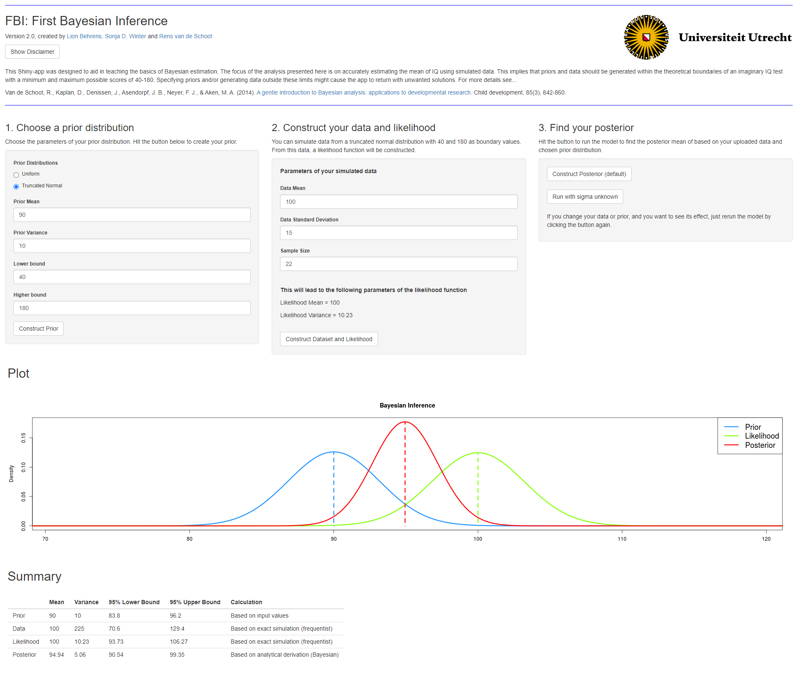

# First-Bayesian-Inference
## :star: Purpose
This Shiny App is designed to ease its users first contact with Bayesian statistical inference, investigate the effect of different prior distributions on the posterior result, and understand prior-data conflict. By "pointing and clicking", the user can analyze the IQ-example that has been used in the easy-to-go introduction to Bayesian inference of [van de Schoot et al. (2013)](https://doi.org/10.1111/cdev.12169). Different prior distributions can be specified, and data with different characteristics can be simulated on the fly. 

## Installation

Download the R-files, open R-studio, install the R-packages and [JAGS](https://mcmc-jags.sourceforge.io/), and run the app.

The Shiny app also runs at a server of [Utrecht University](https://www.rensvandeschoot.com/tutorials/fbi-the-app/). 

## Usage

Step 1: Open the Shiny App.

Step 2: Choose a type of distribution (i.e., uniform, truncated Normal) for the prior and fill in values for the hyperparameters.

Step 3: Generate data.

Step 4: Let the software (analytically or via sampling using RJags) generate the posterior distribution.

## :gem: How can you profit from it?
First of all, this app might be a useful tool for your teaching if you would like to familiarize your students with the basic logic of Bayesian inference. Second, feel free to use this material as a template for your own app. 

## Reference

Van de Schoot, R., Kaplan, D., Denissen, J., Asendorpf, J. B., Neyer, F. J., & Aken, M. A. (2014). A gentle introduction to Bayesian analysis: applications to developmental research. Child development, 85(3), 842-860. [DOI: 10.1111/cdev.12169](https://doi.org/10.1111/cdev.12169).

## Contact

For more information about the App, contact [Lion Behrens](https://www.linkedin.com/in/lion-behrens-7173ab102/), [Sonja Winter](https://www.linkedin.com/in/sonjawinter/), or [Rens van de Schoot](https://www.linkedin.com/in/rensvandeschoot/)